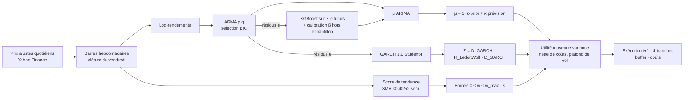

# Safety-First Multi-Asset

**Allocation tactique multi-actifs : prévision hybride ARIMA-XGBoost, volatilité GARCH, optimisation de Markowitz sous filtre de tendance, validée en walk-forward intégral.**

Auteur : Antonin Meudic

---

## Résumé

Ce projet construit et évalue une stratégie d'allocation long-only sur huit ETF représentant des primes de risque distinctes : actions, duration, or, matières premières et immobilier. À chaque semaine et pour chaque actif, une pipeline ré-estimée uniquement sur le passé produit :

1. une prévision du rendement à 4 semaines, avec une composante linéaire **ARIMA** et une correction non linéaire **XGBoost** des résidus, calibrée hors échantillon ;
2. une prévision de volatilité **GARCH(1,1)-t** ;
3. un **score de tendance** fondé sur des moyennes mobiles simples de long terme.

Ces trois entrées alimentent un **optimiseur moyenne-variance** contraint (long-only, sans levier, poche de T-Bills endogène, plafond de volatilité). Le portefeuille est rééquilibré toutes les 4 semaines sur données hebdomadaires, en 4 tranches décalées, avec coûts de transaction, bande de non-transaction et exécution décalée d'une semaine.

La philosophie est **Safety-First** (Roy, 1952) : contrôler les pertes extrêmes passe avant la maximisation du rendement. Le projet est aussi conçu pour **réfuter ses propres composantes**. Chaque brique est soumise à un test hors échantillon et à une ablation, et l'interface affiche les résultats défavorables aussi visiblement que les autres.

---

## Architecture de la pipeline



Toute l'estimation est **walk-forward** : fenêtre glissante de 260 semaines (5 ans), ordre ARMA re-sélectionné chaque année, paramètres ARMA et GARCH ré-estimés chaque semaine, XGBoost ré-entraîné toutes les 4 semaines. À la date *t*, aucune donnée postérieure à *t* n'est utilisée.

---

## Univers d'investissement et benchmark

| Ticker | Exposition | Classe | Rôle dans le portefeuille |
|---|---|---|---|
| SPY | S&P 500 | Actions | Prime de risque actions US |
| EFA | MSCI EAFE | Actions | Actions développées hors US |
| EEM | MSCI Emerging Markets | Actions | Actions émergentes |
| IEF | US Treasuries 7-10 ans | Taux | Duration intermédiaire, amortisseur |
| TLT | US Treasuries 20+ ans | Taux | Duration longue, couverture déflationniste |
| GLD | Or physique | Réels | Couverture monétaire et de risque extrême |
| DBC | Matières premières | Réels | Couverture inflation |
| VNQ | REITs US | Réels | Prime immobilière |

**Construction.** L'univers reprend l'ossature de l'allocation tactique de Faber (2007) : actions US, actions hors US, obligations, immobilier, matières premières. Il la complète par les émergents, la duration longue et l'or, soit une poche par prime de risque structurellement distincte. Deux actifs de la version précédente ont été retirés pour redondance statistique :

- **QQQ**, corrélé à environ 0,9 avec SPY : il concentre le risque technologique sans ajouter de facteur ;
- **LQD**, fortement corrélé à IEF et porteur d'un risque crédit lié aux actions.

Les doublons dégradent le conditionnement de la matrice de covariance, et donc la stabilité de l'optimiseur. L'onglet 1 vérifie la diversification par un clustering hiérarchique (distance √(½(1−ρ)), liaison de Ward, nombre de groupes choisi par silhouette) et par le *nombre effectif de paris* (entropie du spectre de corrélation). Historique commun : février 2006 (lancement de DBC).

**Benchmark principal : 60/40 SPY / IEF**, rééquilibré toutes les 4 semaines, avec les mêmes coûts. C'est le portefeuille de politique d'investissement de référence d'un investisseur diversifié. Il est long-only, sans levier, investissable, sans aucun paramètre estimé, et son niveau de risque est comparable à celui de la stratégie.

**Référence secondaire : 1/N sur l'univers.** DeMiguel, Garlappi & Uppal (2009) montrent que la pondération naïve bat la plupart des optimiseurs hors échantillon. La battre à univers identique isole la valeur ajoutée de la modélisation.

L'ancien benchmark (`^GSPC`) était un indice de **prix**, hors dividendes, comparé à des ETF en rendement total. Ce biais favorisait mécaniquement la stratégie, à hauteur du rendement du dividende (de l'ordre de 1,5 à 2 % par an).

---

## Méthodologie

### 1. Données
- Clôtures quotidiennes **ajustées** (dividendes et splits) agrégées en barres hebdomadaires (dernière clôture de la semaine). La semaine en cours, incomplète, est exclue.
- Taux sans risque : T-Bills 13 semaines (`^IRX`). Il rémunère la poche de liquidité et sert de référence au ratio de Sharpe.
- Variables macro, utilisées uniquement comme features : VIX, taux 10 ans, Dollar Index.
- Le choix de la fréquence hebdomadaire réduit le bruit de microstructure, les effets jour de la semaine et le décalage des fuseaux horaires entre marchés, tout en conservant environ 1 000 observations.

### 2. Filtre de tendance (moyennes mobiles long terme)

$$s_{i,t}=\frac{1}{|L|}\sum_{L\in\{30,40,52\}}\mathbf 1\{P_{i,t}>\mathrm{SMA}_L(P_i)_t\},\qquad 0\le w_{i,t}\le w_{\max}\, s_{i,t}$$

- La SMA 40 semaines est l'équivalent hebdomadaire de la règle 10 mois / 200 jours (Faber, 2007).
- Moyenner trois horizons réduit la dépendance à un paramètre unique et les allers-retours autour d'une seule moyenne.
- Le filtre est une **contrainte**, pas une prévision : il ne force jamais l'achat. Il retire progressivement un actif de l'ensemble admissible quand sa tendance se dégrade.
- Justification empirique, onglet 2 : rendements et volatilités à 4 semaines conditionnés au signal, test de Welch sur les moyennes et test de Levene sur les variances.
- Le détecteur de régimes par chaînes de Markov cachées (HMM) a été **retiré**. Son identification d'états est instable d'une ré-estimation à l'autre, sensible à l'initialisation de l'algorithme EM, et sa labellisation est ad hoc. Pour un gain hors échantillon non démontré, il ajoutait un risque de sur-apprentissage.

### 3. ARIMA : composante linéaire
- **Ordre d'intégration** : tests ADF (H0 : racine unitaire) et KPSS (H0 : stationnarité), d'hypothèses nulles opposées, sur le log-prix puis sur les log-rendements. On obtient d = 1 sur le log-prix, donc un ARMA(p, q) sur les rendements.
- **Sélection de (p, q)** : grille exhaustive {0..3}², critère **BIC**. Le BIC est convergent. L'AICc, affiché pour comparaison, sur-paramètre sur des séries au signal faible : il retient des ARMA(p, p) aux racines quasi compensées, donc des prévisions instables.
- **Diagnostics** : Ljung-Box (bruit blanc des résidus), Jarque-Bera (normalité), ARCH-LM d'Engle (effet ARCH, qui motive le GARCH), QQ-plot.
- **Évaluation hors échantillon** : R² OOS de Campbell & Thompson (2008) contre la moyenne historique et contre zéro, taux de bon sens, coefficient d'information (Spearman), test de **Diebold-Mariano** avec correction de Harvey-Leybourne-Newbold et variance HAC, nécessaire car les cibles à 4 semaines se chevauchent.

### 4. XGBoost sur les résidus : composante non linéaire
Décomposition hybride (Zhang, 2003) :
$\hat r_{t\to t+h}=\sum_{k=1}^h \hat r^{\text{ARIMA}}_{t+k|t}+f(X_t)$, où $f$ apprend $\mathbb E[\sum_{k=1}^h e_{t+k}\mid X_t]$.

- **15 features causales et stationnaires**, documentées dans l'interface : momentum 1/4/12/26 semaines, distance à la SMA 40, drawdown 52 semaines, volatilité réalisée et choc de volatilité, RSI, %B de Bollinger, histogramme MACD normalisé, variation et z-score du VIX, variation du taux 10 ans, variation du dollar.
- Les niveaux bruts non stationnaires sont exclus (prix, MACD en dollars, niveau du VIX). Aucune normalisation : les arbres sont invariants aux transformations monotones.
- **Sans fuite d'information** : seuls les échantillons dont la cible est entièrement observée à la date de décision sont utilisés.
- **Régularisation forte, fixée a priori** : profondeur 2, learning rate 0,01, `min_child_weight` 40, L2 = 20, sous-échantillonnage, ensemble de 3 graines. Avec environ 60 observations indépendantes par fenêtre, une recherche sur grille sur-apprendrait la validation.
- **Calibration hors échantillon** : à chaque ré-entraînement, une validation croisée par blocs **purgés** (embargo de h semaines, López de Prado 2018) produit des prédictions out-of-fold. La pente β ∈ [0, 1] de la régression cible ~ prédiction rétrécit la sortie du modèle. Sans pouvoir prédictif, β → 0 et la correction s'éteint au lieu d'injecter du bruit dans l'optimiseur.
- **Interprétabilité** : importance TreeSHAP (moyenne des |SHAP|) par actif et dans le temps.

### 5. GARCH : volatilité conditionnelle
- Modèle de production : **GARCH(1,1) à innovations Student-t** sur les résidus ARIMA. La variance du rendement cumulé sur l'horizon est $\sum_{k=1}^h \mathbb E_t[\sigma^2_{t+k}]$.
- **Choix de spécification** : log-vraisemblance, AIC et BIC, persistance et demi-vie, comparés entre GARCH-N, GARCH-t, GJR-GARCH-t et EGARCH-t.
- **Évaluation sur l'échantillon de test** avec paramètres gelés :
  - pertes QLIKE (Patton, 2011) et MSE contre le proxy e² ;
  - test de Diebold-Mariano contre EWMA RiskMetrics et contre la variance historique ;
  - régression d'efficience de Mincer-Zarnowitz (a = 0, b = 1) ;
  - ré-estimation de chaque spécification sur l'échantillon de test.
- **Diagnostics des résidus standardisés** : Ljung-Box sur z et z², ARCH-LM, Jarque-Bera.
- Repli EWMA si l'estimation échoue ou si la persistance dépasse 0,999.

### 6. Optimisation de Markowitz

$$\max_w\; w^\top(\mu-r_f\mathbf 1)-\tfrac{\gamma}{2}w^\top\Sigma w-c\,\|w-w^0\|_1\quad\text{s.c.}\quad 0\le w_i\le w_{\max}s_i,\;\mathbf 1^\top w\le 1,\;\sqrt{\tfrac{52}{h}w^\top\Sigma w}\le\sigma_{\text{cap}}$$

- **Utilité plutôt que Sharpe.** En présence d'un actif sans risque, le ratio de Sharpe est invariant d'échelle : il fixe la direction du portefeuille tangent, pas le montant investi. L'utilité quadratique fixe les deux. Hors contraintes actives, sa solution $\Sigma^{-1}(\mu-r_f)/\gamma$ est colinéaire au portefeuille de Sharpe maximal.
- **Intégration des prévisions dans l'objectif** par rétrécissement bayésien vers un prior d'équilibre « Sharpe constant » : $\mu=(1-\kappa)(r_f+\mathrm{SR}_{\text{prior}}\,\sigma)+\kappa\,\hat\mu^{\text{ARIMA-XGB}}$, dans l'esprit de Black-Litterman. Avec κ = 0, l'allocation ne dépend que du risque. C'est la réponse au constat de Michaud (1989) : un optimiseur non contraint est un maximiseur d'erreurs d'estimation.
- **Covariance** $\Sigma=D\,R\,D$ : volatilités GARCH prévues, corrélations sur 2 ans rétrécies par Ledoit-Wolf (2004).
- **Coûts dans l'objectif** : une réallocation n'est effectuée que si le gain d'utilité dépasse son coût.
- La frontière efficiente, avec et sans bornes de tendance, et la décomposition prior / prévision / μ retenu sont affichées à chaque date de rééquilibrage.

### 7. Exécution, timing et coûts
- **Calendrier** : signal à la clôture de la semaine s, exécution à la clôture de s + 1. Aucun ordre n'est passé au prix qui a servi à calculer le signal.
- **Rééquilibrage toutes les 4 semaines**, aligné sur l'horizon de prévision.
- **Tranching** : 4 sous-portefeuilles se rééquilibrent à tour de rôle, une tranche chaque semaine. Le résultat agrégé ne dépend plus du jour arbitraire de rééquilibrage (*rebalance timing luck*, Hoffstein, Faber & Braun 2020) et la dispersion entre tranches est publiée.
- **Comptabilité** : rendements simples, dérive des poids entre rééquilibrages, cash rémunéré au taux des T-Bills.
- **Coûts** : 10 bps par unité échangée (one-way), paramétrables.
- **Buffer** : si le turnover one-way proposé est inférieur à 5 %, la tranche conserve ses positions. Exception : une position qui dépasse sa nouvelle borne de tendance est toujours réduite, car les sorties de risque ne sont jamais différées.

### 8. Mesure de la performance
Rendement annualisé (CAGR), volatilité annualisée, ratio de Sharpe (excès sur T-Bills), drawdown maximal, ratio de Calmar, ainsi que Sortino, t-stat du Sharpe (Lo, 2002), bêta, tracking error et ratio d'information contre le benchmark, turnover et coûts.

---

## Interface (Streamlit)

| Onglet | Contenu |
|---|---|
| **Univers & diversification** | Statistiques descriptives (moments, Jarque-Bera, drawdown), benchmarks, performances cumulées, volatilités glissantes, matrice de corrélation ordonnée par clustering, dendrogramme, nombre effectif de paris, corrélations glissantes |
| **Recherche & preuves statistiques** | 1. ARIMA (ADF/KPSS, ACF/PACF, grilles BIC/AICc, coefficients, diagnostics, prévisions OOS) · 2. XGBoost (features, importance SHAP, stabilité, validation DM) · 3. GARCH (spécifications, paramètres, tests, évaluation sur le test) · 4. Markowitz et tendance (formulation, frontière, bornes SMA, tests conditionnels, ablation) · 5. Timing et exécution (tranching, turnover, coûts, sensibilité buffer × coûts) |
| **Backtest & performance** | Indicateurs clés vs benchmark, performance cumulée, drawdown, tableau de performance, allocation, rendements annuels, Sharpe glissant, export CSV |

Les paramètres de portefeuille et d'exécution (γ, κ, plafond de volatilité, poids maximal, filtre de tendance, coûts, buffer, tranches, date de départ) sont modifiables dans la barre latérale et ré-évalués en quelques secondes. Les signaux walk-forward, coûteux à produire, sont calculés une fois puis mis en cache.

---

## Installation et utilisation

```bash
git clone https://github.com/anto279/strat-invest-direct.git
cd strat-invest-direct
python -m venv .venv && source .venv/bin/activate
pip install -r requirements.txt

# 1. Pipeline complète hors interface : données, signaux (cache), backtest, rapport
python -m scripts.run_research          # --refresh pour re-télécharger les données

# 2. Interface
streamlit run app.py

# 3. Tests des invariants méthodologiques
pytest -q
```

Le premier calcul des signaux ré-estime chaque semaine ARIMA, GARCH et XGBoost pour chaque actif. Il prend environ 5 à 10 minutes sur 4 cœurs (parallélisé par actif), puis il est mis en cache dans `data/cache/`.

Les résultats chiffrés ne figurent volontairement pas dans ce README. Ils dépendent de la date d'extraction des données et sont régénérés de manière reproductible par `scripts/run_research.py` et l'onglet 3.

---

## Structure du dépôt

```
app.py                     Point d'entrée Streamlit (3 onglets)
src/
  config.py                Univers, benchmark, hyper-paramètres (dataclasses immuables)
  data.py                  Téléchargement, barres hebdomadaires, taux sans risque, cache Parquet
  features.py              Features causales et stationnaires (documentées)
  trend.py                 Score de tendance SMA multi-horizon, tests conditionnels
  models/arima.py          Stationnarité, sélection d'ordre, diagnostics
  models/hybrid.py         XGBoost sur résidus, calibration purgée, SHAP
  models/garch.py          Spécifications GARCH, évaluation hors échantillon
  stats_tests.py           Diebold-Mariano, R² OOS, Mincer-Zarnowitz, IC
  signals.py               Génération walk-forward parallèle des signaux
  portfolio.py             Optimiseur moyenne-variance contraint, frontière efficiente
  backtest.py              Moteur hebdomadaire : tranching, coûts, buffer, décalage
  metrics.py               Mesures de performance
  analytics.py             Statistiques descriptives, clustering, diversification
  pipeline.py              Orchestration, ablation, sensibilité
  ui.py, views/            Thème graphique et rendu des onglets
scripts/run_research.py    Pipeline complète en ligne de commande
tests/                     Tests unitaires (données synthétiques)
```

---

## Hypothèses

- Les ETF sont négociables en clôture hebdomadaire avec un coût proportionnel constant. Impact de marché nul, ce qui est réaliste pour ces encours.
- Les prix ajustés de Yahoo Finance reflètent fidèlement le rendement total, dividendes réinvestis et nets des frais de gestion.
- Les paramètres des modèles sont localement stables sur une fenêtre de 5 ans.
- Le taux des T-Bills 13 semaines est accessible pour la poche de liquidité, par exemple via un fonds monétaire.
- Les hyper-paramètres sont fixés **a priori** à partir de la littérature et ne sont pas optimisés sur la période de backtest.

## Avantages

- **Walk-forward strict et sans look-ahead** : features causales, cibles purgées, exécution décalée et barres hebdomadaires complètes. Ces invariants sont vérifiés par des tests unitaires.
- **Chaque brique est réfutable** : tests hors échantillon, Diebold-Mariano, ablation composante par composante.
- **Robustesse aux erreurs d'estimation** : prior d'équilibre, calibration β de XGBoost, Ledoit-Wolf et contraintes de poids.
- **Gestion du risque explicite et lisible** : long-only, plafond de volatilité, sortie progressive en cash via le filtre de tendance, sorties de risque prioritaires sur le buffer.
- **Réalisme opérationnel** : coûts intégrés à l'objectif et à la comptabilité, buffer, tranching et dispersion entre tranches publiés.
- **Reproductibilité** : configuration immuable et hachée, cache déterministe, script en ligne de commande.

## Limites

- **Prévisibilité faible.** À l'horizon mensuel, la composante prévisible des rendements est très faible : des R² hors échantillon de quelques dixièmes de pourcent sont la norme dans la littérature (Welch & Goyal, 2008). La contribution des prévisions doit être lue dans l'ablation, pas présumée.
- **Échantillon court pour l'inférence.** Environ 15 ans hors échantillon représentent moins de 200 périodes de 4 semaines indépendantes. Les tests sur le Sharpe ont une puissance limitée, et le backtest ne couvre ni 2000-2002 ni 2008 en totalité (historique de DBC).
- **Instabilité des corrélations.** La corrélation actions / obligations est devenue positive en 2022. La diversification historique n'est pas garantie et les filtres de tendance réagissent avec retard aux retournements brutaux, comme en mars 2020.
- **Retard structurel du filtre de tendance.** Il protège contre les marchés baissiers prolongés, pas contre les krachs soudains, et il génère des faux signaux en marché sans tendance.
- **Modèle de coûts simplifié.** Coût linéaire constant, pas de spread variable en période de stress, pas de fiscalité.
- **Investissabilité pour un épargnant européen.** Les ETF américains ne sont pas accessibles aux particuliers de l'UE (réglementation PRIIPs). Une mise en œuvre réelle passerait par des équivalents UCITS, avec un écart de suivi et une exposition au change EUR/USD non modélisés ici.
- **Risque de modèle.** Hypothèses gaussiennes conditionnelles dans l'utilité, GARCH symétrique pour tous les actifs, ARMA linéaire. Le biais de sélection de l'univers lui-même, choisi en connaissant l'historique, ne peut être totalement éliminé.

---

## Corrections par rapport à la version précédente

| Problème identifié | Correction |
|---|---|
| Rendement du portefeuille calculé comme somme pondérée de **log-rendements** | Comptabilité en rendements simples avec dérive hebdomadaire des poids |
| Signal et exécution sur la **même clôture** (look-ahead) | Exécution à la clôture suivante (`execution_lag = 1`) |
| Barres `1wk` de Yahoo incluant la **semaine en cours incomplète** | Agrégation hebdomadaire depuis les données quotidiennes, semaine incomplète exclue |
| Benchmark `^GSPC` **hors dividendes** vs ETF en rendement total | Benchmark 60/40 en rendement total, mêmes coûts, plus référence 1/N |
| SMA 50/200 appliquées à des données **hebdomadaires** (SMA 200 = 4 ans) | SMA 30/40/52 semaines (équivalents 7, 10 et 12 mois), score multi-horizon |
| **Ventes à découvert** en régime baissier, incohérentes avec Safety-First | Long-only ; la poche non investie est placée en T-Bills |
| Max-Sharpe sous Σ\|w\| ≤ 1 **mal posé** (invariance d'échelle), r_f/52 pour un horizon de 4 semaines | Utilité moyenne-variance à l'horizon, plafond de volatilité, unités cohérentes |
| Taux sans risque **fixe à 2 %** | Série des T-Bills 13 semaines |
| Z-score glissant calculé sur des données concaténées, features **non stationnaires** | Features stationnaires, pas de normalisation (inutile pour les arbres) |
| XGBoost non régularisé hors échantillon | Calibration β par validation croisée purgée, régularisation renforcée |
| AIC via `auto_arima` sur-paramétrant | Grille exhaustive au BIC, AICc reporté pour contrôle |
| GARCH évalué contre sa **propre** volatilité ajustée ex-post (circularité) | QLIKE / MSE contre le proxy e², test DM contre EWMA, Mincer-Zarnowitz |
| Buffer de **40 %** de turnover, pouvant bloquer les sorties de risque | Buffer de 5 % one-way avec priorité absolue aux sorties de risque |
| Tranches affichées séparément, sans portefeuille agrégé | Agrégation des 4 tranches et publication de leur dispersion |
| Sharpe = (CAGR − 2 %)/σ, mélange géométrique / arithmétique | Moyenne arithmétique des rendements excédentaires × 52 / σ |
| Univers redondant (QQQ, LQD) | Une poche par prime de risque, validée par clustering |
| HMM instable | Supprimé |

---

## Références

- Bailey, D., López de Prado, M. (2012). The Sharpe Ratio Efficient Frontier. *Journal of Risk*.
- Black, F., Litterman, R. (1992). Global Portfolio Optimization. *Financial Analysts Journal*.
- Bollerslev, T. (1986). Generalized Autoregressive Conditional Heteroskedasticity. *Journal of Econometrics*.
- Campbell, J., Thompson, S. (2008). Predicting Excess Stock Returns Out of Sample. *Review of Financial Studies*.
- Chen, T., Guestrin, C. (2016). XGBoost: A Scalable Tree Boosting System. *KDD*.
- Choueifaty, Y., Coignard, Y. (2008). Toward Maximum Diversification. *Journal of Portfolio Management*.
- DeMiguel, V., Garlappi, L., Uppal, R. (2009). Optimal Versus Naive Diversification. *Review of Financial Studies*.
- Diebold, F., Mariano, R. (1995). Comparing Predictive Accuracy. *Journal of Business & Economic Statistics*.
- Faber, M. (2007). A Quantitative Approach to Tactical Asset Allocation. *Journal of Wealth Management*.
- Glosten, L., Jagannathan, R., Runkle, D. (1993). On the Relation between the Expected Value and the Volatility of the Nominal Excess Return on Stocks. *Journal of Finance*.
- Harvey, D., Leybourne, S., Newbold, P. (1997). Testing the Equality of Prediction Mean Squared Errors. *International Journal of Forecasting*.
- Hoffstein, C., Faber, N., Braun, S. (2020). Rebalance Timing Luck. *Journal of Index Investing*.
- Hurst, B., Ooi, Y., Pedersen, L. (2017). A Century of Evidence on Trend-Following Investing. *Journal of Portfolio Management*.
- Ledoit, O., Wolf, M. (2004). A Well-Conditioned Estimator for Large-Dimensional Covariance Matrices. *Journal of Multivariate Analysis*.
- Lo, A. (2002). The Statistics of Sharpe Ratios. *Financial Analysts Journal*.
- López de Prado, M. (2018). *Advances in Financial Machine Learning*. Wiley.
- Lundberg, S., Lee, S.-I. (2017). A Unified Approach to Interpreting Model Predictions. *NeurIPS*.
- Mantegna, R. (1999). Hierarchical Structure in Financial Markets. *European Physical Journal B*.
- Markowitz, H. (1952). Portfolio Selection. *Journal of Finance*.
- Michaud, R. (1989). The Markowitz Optimization Enigma: Is 'Optimized' Optimal? *Financial Analysts Journal*.
- Moskowitz, T., Ooi, Y., Pedersen, L. (2012). Time Series Momentum. *Journal of Financial Economics*.
- Patton, A. (2011). Volatility Forecast Comparison Using Imperfect Volatility Proxies. *Journal of Econometrics*.
- Roy, A. D. (1952). Safety First and the Holding of Assets. *Econometrica*.
- Welch, I., Goyal, A. (2008). A Comprehensive Look at the Empirical Performance of Equity Premium Prediction. *Review of Financial Studies*.
- Zhang, G. P. (2003). Time Series Forecasting Using a Hybrid ARIMA and Neural Network Model. *Neurocomputing*.

---

*Projet de recherche à visée pédagogique. Ne constitue pas un conseil en investissement. Les performances passées, a fortiori simulées, ne préjugent pas des performances futures.*
